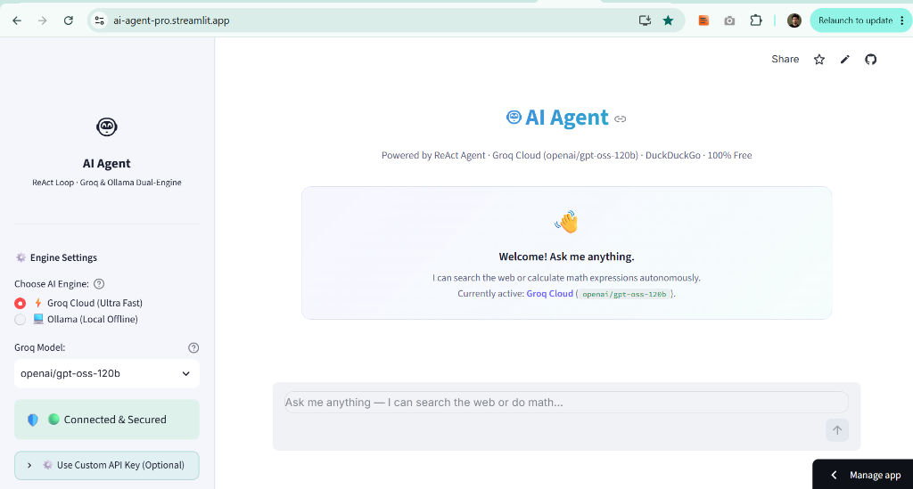
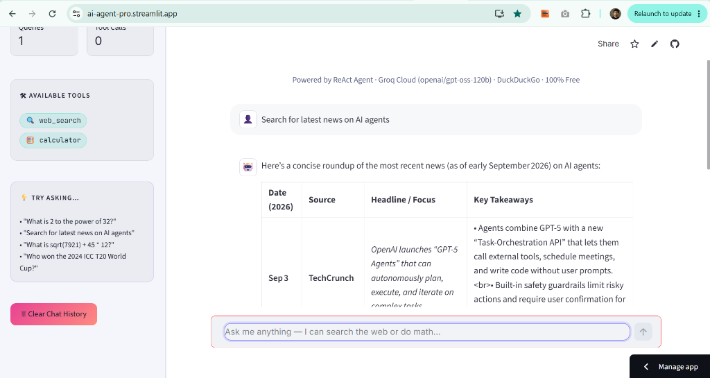
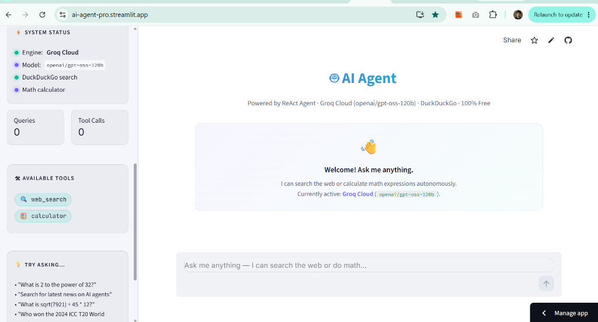
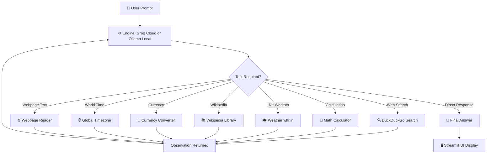

# 🤖 Autonomous AI Agent — Streamlit × Groq Cloud × Ollama × ReAct

An autonomous, **100% free and open-source** AI Agent web application built with **Streamlit**, **Groq Cloud**, **Ollama**, and **LangChain**. It features an autonomous ReAct (Reasoning + Acting) loop with real-time web search and mathematical reasoning capabilities — supporting both **ultra-fast cloud inference (Groq)** and **offline local inference (Ollama)**.

> 🌐 **Live Demo:** [ai-agent-pro.streamlit.app](https://ai-agent-pro.streamlit.app/)

---

## 📸 Screenshots & Demos

### 🌐 Live Cloud Web Application
Deployed 24/7 on Streamlit Cloud with dual-engine switching and secure backend integration:


### 🔍 Real-Time Information Retrieval & Formatting
Live autonomous web search answering questions with structured markdown tables:


### ⚡ Real-Time System Status & Engine Monitoring
Sidebar system status monitor showing active provider, model, and tool usage counters:


### 🧮 Math Calculator in Action
Autonomous tool invocation for safe mathematical calculations:


---

## ✨ Features

- ⚡ **Dual AI Engines:**
  - **Groq Cloud (Default):** Lightning-fast inference on LPUs using massive models (`openai/gpt-oss-120b`, `openai/gpt-oss-20b`, `qwen/qwen3.6-27b`). 100% free tier (up to 14,400 requests/day).
  - **Ollama Local:** Run 100% offline on your own machine (`qwen2.5:3b`, `llama3`). Zero internet required.
- 🔄 **Autonomous ReAct Agent Loop:** Implements multi-step reasoning (`Thought` ➔ `Action` ➔ `Observation` ➔ `Final Answer`).
- 🛠️ **7 Integrated 100% Free Tools:**
  - **🔍 DuckDuckGo Search:** Live internet queries without requiring any search API keys.
  - **🧮 Safe Math Calculator:** Evaluates mathematical expressions safely using Python's standard `math` module (supports trigonometry, log, powers, factorial, square roots, constants $\pi$, $e$).
  - **🌦️ Live Weather:** Real-time weather, temperature, humidity, and wind conditions for any city worldwide via `wttr.in`.
  - **📚 Wikipedia Search:** Verified factual summaries, history, and scientific deep-dives via the `wikipedia` library.
  - **💱 Live Currency Converter:** Real-time foreign exchange conversions powered by European Central Bank rates (Frankfurter API).
  - **⏰ Global Time & Date:** Accurate real-world date, time, and day resolver across all world timezones.
  - **🌐 Webpage Reader:** Scrapes and extracts readable text from public webpage URLs for analysis via `BeautifulSoup`.
- 🎨 **Modern & Responsive UI:**
  - Clean light interface with custom CSS.
  - Sidebar engine switcher & live status monitors.
  - Collapsible interactive tool inspection expanders.
  - Real-time metrics tracking total queries and tool calls executed.
  - One-click session reset / chat history purge.
- ☁️ **Cloud Deployment Ready:** Live 24/7 on **Streamlit Community Cloud** with 1-click GitHub sync.

---

## 🏗️ Architecture & Agent Flow



---

## 🛠️ Tech Stack

| Layer | Technology | Description |
|---|---|---|
| **Frontend / Web App** | [Streamlit](https://streamlit.io/) | Modern reactive web UI |
| **Cloud LLM Engine** | [Groq Cloud](https://groq.com/) | Ultra-low latency LPU inference (100% Free) |
| **Local LLM Engine** | [Ollama](https://ollama.com/) | Offline local model inference |
| **Agent Orchestration** | [LangChain](https://www.langchain.com/) | Message handling, prompt engineering & tool schemas |
| **Web Search** | `ddgs` (DuckDuckGo) | Free, rate-limit friendly search engine |
| **Weather API** | `wttr.in` | Global weather open endpoint (zero key) |
| **Encyclopedia** | `wikipedia` | Open knowledge lookup |
| **Forex Rates** | `Frankfurter API` | European Central Bank open exchange data |
| **Web Scraping** | `BeautifulSoup4` + `requests` | HTML clean text parsing |
| **Language** | Python 3.10+ | Core application logic |

---

## 🚀 Quick Start (Local)

### 1. Clone Repository & Install Dependencies

```bash
# Clone repository
git clone https://github.com/ahmedraheed/Ai-Agent.git
cd Ai-Agent

# Install python dependencies
pip install -r requirements.txt
```

### 2. Configure Environment (Optional for Groq)

Create a `.env` file in the root folder (or enter your key directly in the sidebar):

```env
GROQ_API_KEY=your_free_groq_api_key_here
```
> 💡 Get a free Groq API key in 30 seconds at [console.groq.com/keys](https://console.groq.com/keys) (No credit card needed).

### 3. Launch the Application

```bash
streamlit run app.py
```

Open your browser and navigate to: `http://localhost:8501` (or `http://localhost:8502`).

---

## ☁️ Deploy to Streamlit Cloud (24/7 Free Hosting)

1. Fork or push this repository to your GitHub account.
2. Visit **[share.streamlit.io](https://share.streamlit.io/)** and sign in with GitHub.
3. Click **"New app"** and select:
   - **Repository:** `ahmedraheed/Ai-Agent`
   - **Branch:** `main`
   - **Main file path:** `app.py`
4. Expand **Advanced settings** ➔ **Secrets**, and paste:
   ```toml
   GROQ_API_KEY = "your_free_groq_api_key_here"
   ```
5. Click **Deploy!** — Your AI Agent is now live on the internet! 🚀

---

## 📁 Project Structure

```text
Ai-Agent/
├── assets/
│   ├── live-cloud-home.png     # Screenshot of live deployed cloud home screen
│   ├── live-cloud-chat.png     # Screenshot of live web search in table format
│   ├── live-cloud-sidebar.png  # Screenshot of live system status & metrics
│   ├── demo-calculator.png     # Screenshot showing math calculator tool
│   └── demo-search.png         # Screenshot showing local web search tool
├── .env.example                # Template for environment variables
├── .gitignore                  # Protected secrets (.env) & temporary files
├── app.py                      # Main Streamlit & AI Agent application
├── README.md                   # Project documentation & deployment guide
└── requirements.txt            # Python dependencies
```

---

## 💡 Example Queries to Try

- **🌦️ Live Weather:**
  - *"What is the weather and temperature in Lahore and London right now?"*
  - *"Is it raining in Tokyo today?"*
- **💱 Currency Conversion:**
  - *"Convert 250 USD to EUR"*
  - *"How much is 100 GBP in Japanese Yen today?"*
- **📚 Wikipedia Research:**
  - *"Who was Alan Turing and what was his contribution to computing?"*
  - *"Search Wikipedia for Quantum Computing summary"*
- **⏰ Global Timezones:**
  - *"What time and date is it in Tokyo and New York right now?"*
- **🧮 Math & Science:**
  - *"What is the square root of 7921 multiplied by 2 to the power of 8?"*
  - *"Calculate sin(90) + cos(0)"*
  - *"What is the factorial of 8?"*
- **🔍 Live Web Information:**
  - *"What is the current price of Bitcoin today?"*
  - *"Search for the latest breakthroughs in Artificial Intelligence"*
- **🔄 Multi-Step Reasoning:**
  - *"Search for the population of Germany, then calculate 15% of it."*
  - *"What is the weather in Paris, and what time is it there right now?"*

---

## 🤝 Contributing

Contributions, issues, and feature requests are welcome! Feel free to check the [issues page](https://github.com/ahmedraheed/Ai-Agent/issues).

---

## 📄 License

This project is open-source and available under the [MIT License](LICENSE).
