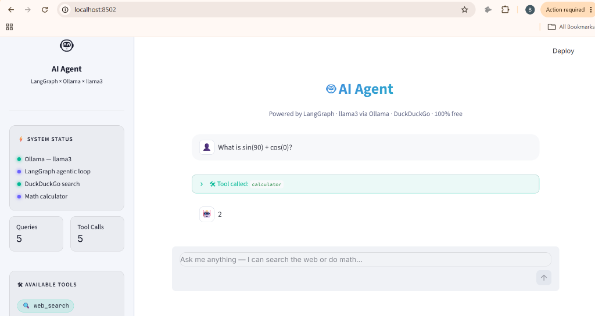
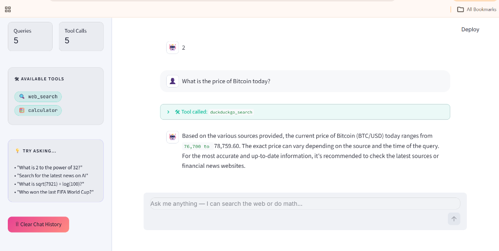
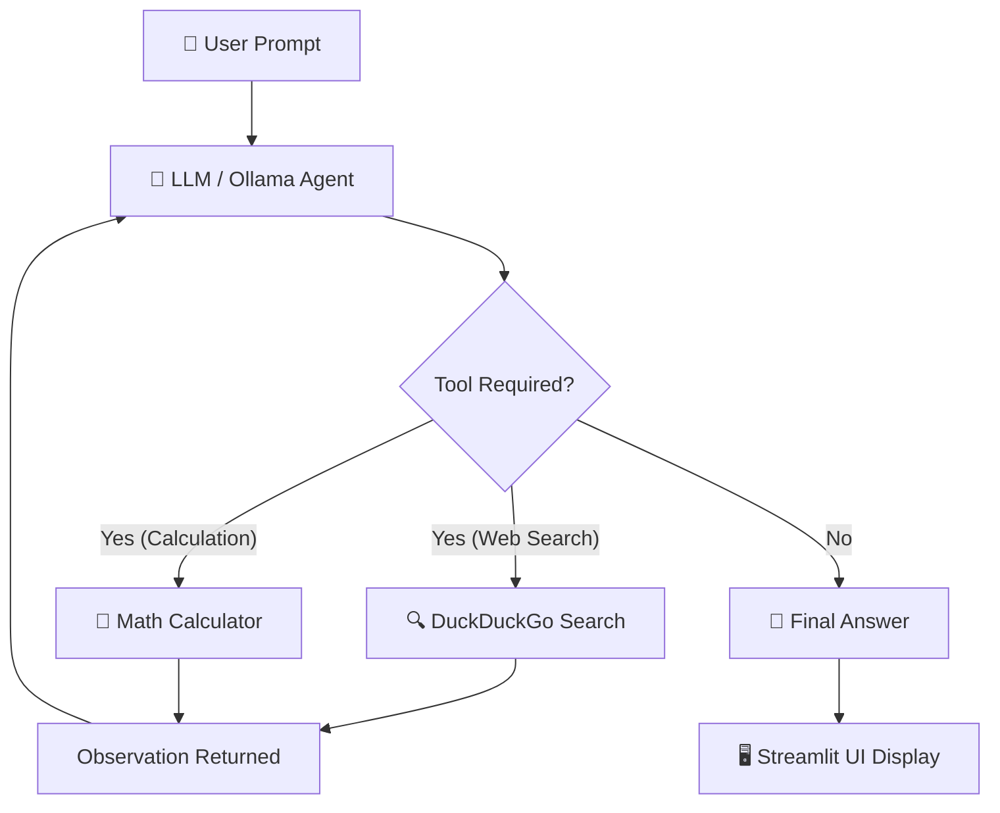

# 🤖 Autonomous AI Agent — Streamlit × Ollama × ReAct

An autonomous, **100% free and open-source** AI Agent web application built with **Streamlit**, **Ollama**, and **LangChain**. It features an autonomous ReAct (Reasoning + Acting) loop with real-time web search and mathematical reasoning capabilities — **no paid API keys required**.

---

## 📸 Screenshots & Demos

### 🧮 Math Calculator in Action
Autonomous tool invocation for safe mathematical calculations:


### 🔍 Real-Time DuckDuckGo Web Search
Live information retrieval using DuckDuckGo:


---

## ✨ Features

- 🆓 **100% Free & Local:** Powered by **Ollama** (`qwen2.5:3b` or `llama3`) running locally on your hardware. Zero API costs, zero subscriptions.
- 🔄 **Autonomous ReAct Agent Loop:** Implements multi-step reasoning (`Thought` ➔ `Action` ➔ `Observation` ➔ `Final Answer`).
- 🛠️ **Integrated Tools:**
  - **🔍 DuckDuckGo Search:** Live internet queries without requiring any search API keys.
  - **🧮 Safe Math Calculator:** Evaluates mathematical expressions safely using Python's standard `math` module (supports trigonometry, log, powers, factorial, square roots, constants $\pi$, $e$).
- 🎨 **Modern & Responsive UI:**
  - Clean light interface with custom CSS.
  - Collapsible interactive tool inspection expanders.
  - Real-time metrics tracking total queries and tool calls executed.
  - One-click session reset / chat history purge.

---

## 🏗️ Architecture & Agent Flow



---

## 🛠️ Tech Stack

| Layer | Technology | Description |
|---|---|---|
| **Frontend / Web App** | [Streamlit](https://streamlit.io/) | Modern reactive web UI |
| **Local LLM Engine** | [Ollama](https://ollama.com/) | High-performance local model inference |
| **Model** | `qwen2.5:3b` / `llama3` | Fast, lightweight models supporting tool use |
| **Agent Orchestration** | [LangChain](https://www.langchain.com/) | Message handling & tool structure |
| **Web Search** | `ddgs` (DuckDuckGo) | Free, rate-limit friendly search engine |
| **Language** | Python 3.10+ | Core application logic |

---

## 🚀 Quick Start

### 1. Prerequisites

Make sure you have **Python 3.10+** and **Ollama** installed on your system.

- Download Ollama: [ollama.com/download](https://ollama.com/download)

### 2. Pull the Local Model

In your terminal, pull the recommended model (`qwen2.5:3b` or `llama3`):

```bash
ollama pull qwen2.5:3b
```

Ensure Ollama is running:
```bash
ollama serve
```

### 3. Clone Repository & Install Dependencies

```bash
# Clone repository
git clone https://github.com/ahmedraheed/Ai-Agent.git
cd Ai-Agent

# Install python dependencies
pip install -r requirements.txt
```

### 4. Launch the Application

```bash
streamlit run app.py
```

Open your browser and navigate to:
```
http://localhost:8501
```
*(or `http://localhost:8502` if port 8501 is busy)*

---

## 📁 Project Structure

```text
Ai-Agent/
├── assets/
│   ├── demo-calculator.png    # Screenshot showing math calculator tool
│   └── demo-search.png        # Screenshot showing web search tool
├── .gitignore                 # Ignored files (virtual environments, caches)
├── app.py                     # Main Streamlit & AI Agent application
├── README.md                  # Project documentation
└── requirements.txt           # Python dependencies
```

---

## 💡 Example Queries to Try

- **Math & Science:**
  - *"What is the square root of 7921 multiplied by 2 to the power of 8?"*
  - *"Calculate sin(90) + cos(0)"*
  - *"What is the factorial of 8?"*
- **Live Information:**
  - *"What is the current price of Bitcoin today?"*
  - *"Search for the latest breakthroughs in Artificial Intelligence"*
  - *"Who won the most recent ICC Cricket World Cup?"*
- **Multi-Step Reasoning:**
  - *"Search for the current population of Japan, then calculate 15% of it."*

---

## 🤝 Contributing

Contributions, issues, and feature requests are welcome! Feel free to check the [issues page](https://github.com/ahmedraheed/Ai-Agent/issues).

---

## 📄 License

This project is open-source and available under the [MIT License](LICENSE).
